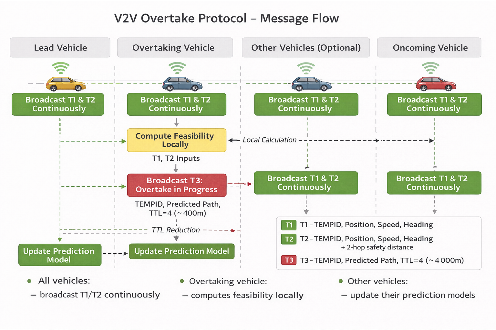
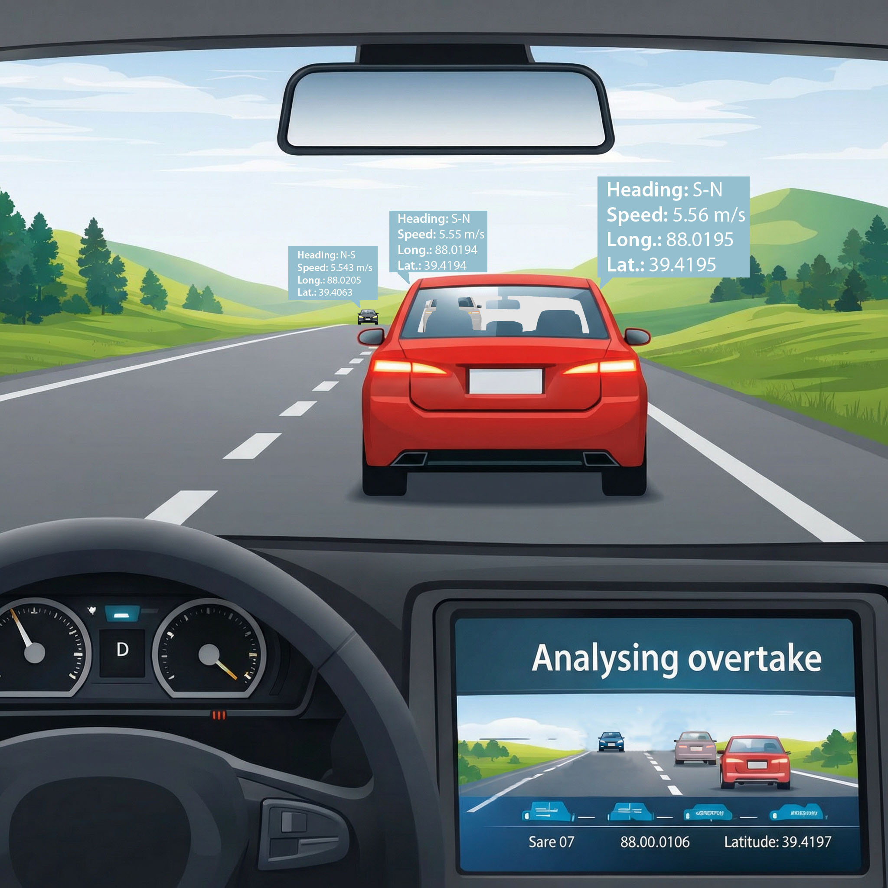

     

# Open Vehicle-to-Vehicle Overtake Assistance Protocol

Specification version: 0.1.0

An open, decentralized protocol proposal for cooperative overtaking safety.

## Overview

This project proposes an open, lightweight Vehicle-to-Vehicle (V2V) communication protocol designed to help drivers safely perform overtaking manoeuvres on two-lane roads.

It allows vehicles to share real-time motion data such as position, speed, and heading, enabling onboard systems to determine whether an overtake can be safely completed before an oncoming vehicle arrives.

The protocol is intentionally simple, bandwidth-efficient, and suitable for global adoption.

This repository contains an open proposal currently in review and development.

Contributions, critiques, and improvements are welcome.

---
## Specification Status

Version: 0.1.0  
Status: Draft  
Date: February, 2026  
This document follows semantic versioning.

This specification is not finalized and may change.

It is intended for technical review, simulation, and prototype implementation.

---

## Author

Emiliano Martín  
Independent Researcher  
Argentina  
GitHub: https://github.com/emilianofmartin 
Contact: via GitHub Issues

---

## How to Cite This Work

If you use this work in research, simulation, publications, or
implementations, please cite it as:

**Martín, Emiliano F.**\
*Open Vehicle-to-Vehicle Overtake Assistance Protocol*.\
Version 0.1.0, February 2026.\
Available at: https://github.com/emilianofmartin/v2v-overtake-protocol

------------------------------------------------------------------------

### BibTeX Entry

Use the following BibTeX reference:

    @misc{martin2026v2vovertake,
      author       = {Martín, Emiliano F.},
      title        = {Open Vehicle-to-Vehicle Overtake Assistance Protocol},
      year         = {2026},
      month        = {February},
      version      = {0.1.0},
      publisher    = {GitHub},
      url          = {https://github.com/emilianofmartin/v2v-overtake-protocol}
    }

--- 

## Specification

Full specification document:

[Download Specification v0.1.0 (PDF)](https://github.com/emilianofmartin/v2v-overtake-protocol/releases/download/v0.1.0/protocol_v0.1.0.pdf)

(Official frozen version — February 2026)

---

## The Problem

Head-on collisions during overtaking manoeuvres remain one of the most severe types of road accidents worldwide.

The fundamental limitation is simple:

Drivers cannot see far enough ahead to make fully informed decisions.

Even in perfect weather and daylight, hills, curves, trucks, and other vehicles obstruct visibility.

Human estimation of distance, speed, and closing time is inherently imprecise.

Existing driver assistance systems rely primarily on onboard sensors such as cameras and radar, which are limited by line-of-sight.

They cannot detect vehicles hidden beyond visual obstacles.

---

## The Missing Piece

The missing capability is cooperation.

If vehicles could communicate their position and motion directly to each other, they would no longer depend solely on line-of-sight.

This protocol enables exactly that.

Vehicles continuously share their motion state using small broadcast messages, allowing each vehicle to build a real-time model of surrounding traffic beyond visual range.

This allows safe overtaking decisions based on actual vehicle data, not guesswork.

---

## What This Protocol Provides

• Real-time vehicle motion awareness beyond visual range  
• Cooperative overtaking safety assistance  
• Extremely low bandwidth usage  
• Fully decentralized operation  
• No infrastructure dependency  
• Built-in privacy through temporary anonymous identifiers  
• Compatibility with emergency vehicle signaling  
• Support for non-cooperative object reporting  

---

## Emergency Vehicle Awareness

The protocol supports identification of emergency vehicles such as ambulances, police, and fire units.

This enables:

• Increased safety margins during overtaking calculations  
• Clear driver awareness of approaching emergency vehicles  
• Improved driver cooperation when yielding  

This capability extends the protocol beyond overtaking assistance into broader cooperative road safety.

---

## Feasibility

One of the primary concerns with any V2V protocol is communication channel saturation.

This protocol was designed from the ground up to minimize bandwidth usage.

Typical transmission rate per vehicle:

~5 kbit/s

Even in dense traffic scenarios with 100 vehicles:

~500 kbit/s total

This is well below the capacity of modern V2V communication technologies such as:

• IEEE 802.11p / ITS-G5  
• C-V2X sidelink  

Feasibility analysis included in this repository demonstrates that the protocol does not pose a realistic risk of channel saturation.

---

## Privacy

Vehicles use temporary anonymous identifiers (TEMPID).

These identifiers:

• Contain no embedded meaning  
• Are randomly generated  
• Change periodically  
• Cannot be traced back to a specific vehicle  

This prevents long-term tracking while preserving operational functionality.

---

## Current Status

This specification is a proposal.

It is not a finalized standard.

It is intended as a foundation for collaborative development, technical review, and real-world experimentation.

The core communication model, message structure, and feasibility analysis are complete.

Further work may include:

• Security layer definition  
• Reference implementation  
• Simulation and validation  
• Hardware prototyping  

---

## Background

Some of the ideas explored in this proposal originated from earlier personal work on cooperative traffic analysis concepts.

That previous work helped identify both the potential benefits and the practical challenges of sharing vehicle motion data between nearby vehicles.

While that earlier effort was conceptual and not formally published, it provided valuable perspective that influenced the design priorities of this protocol, particularly regarding simplicity, bandwidth efficiency, and decentralized operation.

---

## Why This Matters

This protocol could help reduce one of the most dangerous driving manoeuvres performed daily.

It does not require new infrastructure.

It does not require centralized systems.

It only requires vehicles to cooperate.

---

## Goals

This project aims to:

• Provide an open foundation for cooperative overtaking assistance  
• Enable technical discussion and review  
• Encourage experimentation and implementation  
• Remain open and vendor-neutral  

---

---

## Intended Audience

This specification may be of interest to:

• V2V and ITS engineers  
• Automotive software developers  
• Researchers in intelligent transportation systems  
• Road safety specialists  
• Embedded systems engineers  
• Simulation and modeling researchers  
• Automotive OEM engineers and suppliers  

No prior involvement in this project is required.

Technical review, criticism, and alternative approaches are highly encouraged.

---

## Call for Contributors

This project is in active conceptual development.

Engineers, researchers, and enthusiasts are welcome to:

• Review the specification  
• Suggest improvements  
• Identify edge cases  
• Implement prototypes  
• Run simulations  

Critical feedback is especially valuable.

---

## Repository Contents

- [Protocol Specification v0.1.0 (Official Release PDF)](https://github.com/emilianofmartin/v2v-overtake-protocol/releases/download/v0.1.0/protocol_v0.1.0.pdf)
- [Concept Illustration](docs/illustration.jpg)
- [Message flow diagrams (PNG)](docs/messages-flow-diagram.png)    
- [Feasibility analysis (XLSX)](docs/feasibility.xlsx)

---

## Message Flow Overview

The protocol operates using continuous broadcast and fully decentralized decision-making.

**All vehicles**

Continuously broadcast:

• T1 — Static vehicle information  
• T2 — Dynamic motion state (position, speed, heading)

These messages allow all nearby vehicles to maintain a real-time local model of surrounding traffic.

**Overtaking vehicle**

When the driver intends to overtake, the vehicle:

• Uses received T1 and T2 messages  
• Computes overtaking feasibility locally  
• No permission or coordination request is required  

If the overtaking manoeuvre begins, the vehicle broadcasts:

• T3 — Overtake in progress notification

This message informs nearby vehicles of the manoeuvre.

**Other vehicles**

Upon receiving T3:

• Update their prediction models  
• Increase safety margins  
• Improve awareness of the ongoing manoeuvre  

No acknowledgement or response is required.

---

## Message flow diagram (non-normative)

This diagram is provided for illustration only.  
Normative behaviour is defined by the specification document.

---

## Concept Illustration (non-normative)

This diagram is provided for illustration only.  
Normative behaviour is defined by the specification document.

---

## License

This project is licensed under the Apache License 2.0.

You are free to use, implement, modify, and distribute this work under the terms of that license.

---

## Final Note

This project began with a simple observation:

Many overtaking accidents occur not because drivers act recklessly, but because they lack information.

This protocol aims to provide that information.

